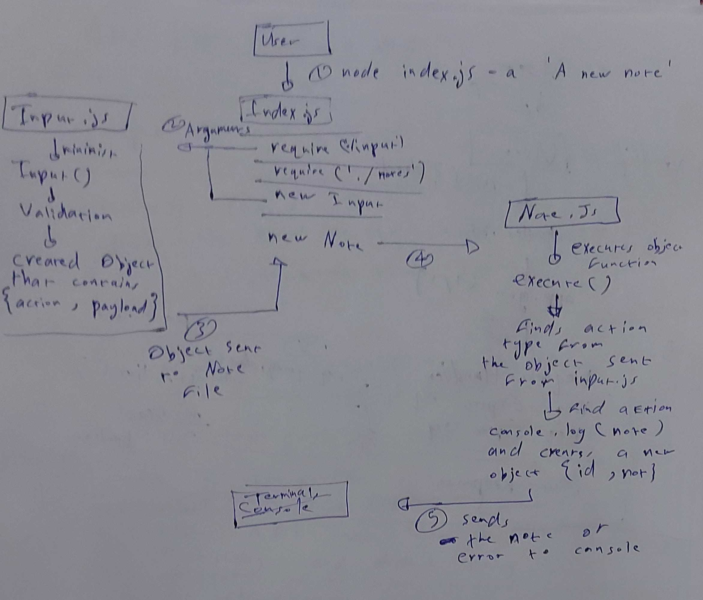

# LAB - 01

## Notesy 

### Author: Ammar Badwan

### Links and Resources
- [submission PR](https://github.com/ammarBadwan-401-advanced-javascript/notes/pull/2)
- [GitHub Actions](https://github.com/ammarBadwan-401-advanced-javascript/notes/runs/687317645?check_suite_focus=true)

### Modules

#### `./lib/input.js`
#### `./lib/notes.js`

### Exported Values and Methods

#### `Input() -> Returns an object from the command line arguments`
#### `Note(inputResult) -> Takes the object from the input and executes it and find the method and invokes its function`

### How to initialize your application
* `node index.js (--add or -a) 'The note you want to save'

### Tests
* Lint test: `npm run lint`
* Unit test: `npm test`

### UML 

